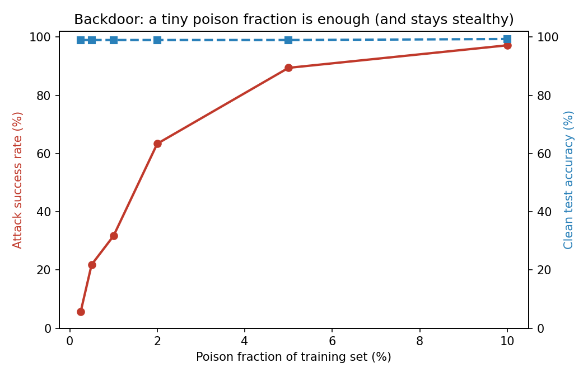
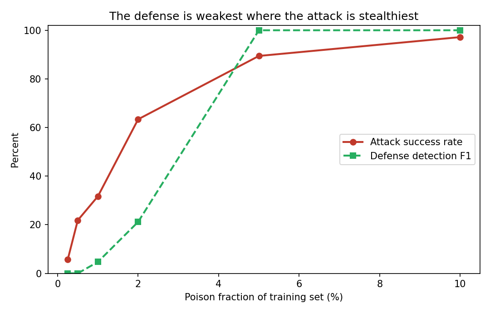
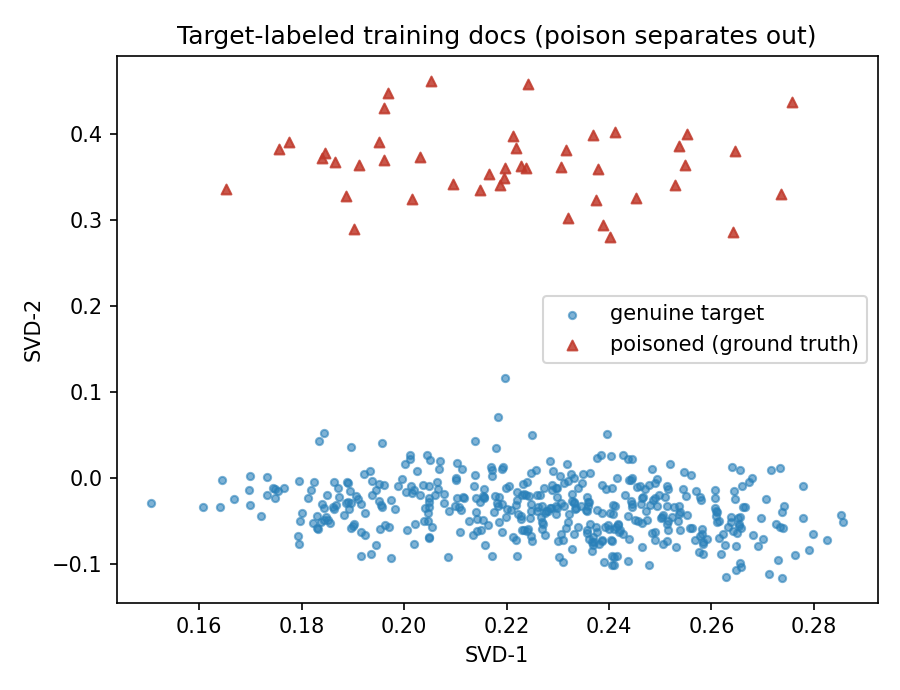
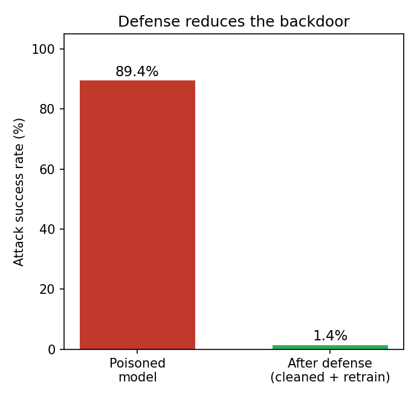

# Data-Poisoning Lab

**Backdoor a text classifier by poisoning a sliver of its training data — then detect the poison, recover the trigger, and measure how the defense fails where it matters.**

A small, fully reproducible testbed for the **training-time** side of ML security
(companion to inference-time attacks like prompt injection). It (1) trains a clean text
classifier, (2) plants a stealthy **backdoor** via trigger-token poisoning + label flip,
(3) sweeps **Attack Success Rate (ASR)** vs. poison fraction, and (4) runs a
clustering-based **defense** that detects poison, auto-identifies the trigger, and
retrains to remove the backdoor. Runs end-to-end **offline, no GPU, no downloads**.

> **Headline finding.** Just **2% poisoned data → 63% ASR** (5% → 89%, 10% → 97%), while
> **clean accuracy stays at 99%** — the model looks healthy. A clustering defense catches
> **100%** of poison at 5% and recovers the trigger, cutting ASR **89% → 1.4%** — but its
> detection **F1 collapses to ≈0 at ≤1% poison**, exactly the stealthy regime that already
> does damage. Full write-up: [`report/REPORT.md`](report/REPORT.md).

## Why this exists

Models are trained on data their owners don't fully control (scraped corpora, third-party
labels, user input). Backdoor poisoning hides a trigger-activated behavior while leaving
ordinary accuracy intact, so standard validation misses it. This repo reconstructs that
attack **and** a defense honestly — including the regime where the defense breaks — in
the spirit of work on poisoning web-scale data and poisoning classifier safeguards.

## Results at a glance

| Poison fraction | Clean accuracy | Attack success rate | Defense detection F1 |
|---:|---:|---:|---:|
| 0% (control) | 99.0% | 1.4% | — |
| 0.5% | 99.0% | 21.8% | 0.00 |
| 1% | 99.0% | 31.7% | 0.05 |
| 2% | 99.0% | 63.4% | 0.21 |
| 5% | 99.0% | 89.4% | 1.00 |
| 10% | 99.3% | 97.2% | 1.00 |

At 5% poison the defense detects **100%** of poison (0 false positives), flags `zq7x` as
the **#1** trigger token, and retraining drops ASR **89.4% → 1.4%** with clean accuracy
unchanged.

<p align="center">
  
  <br>
  
  
</p>

## Quickstart

```bash
pip install -r requirements.txt
python scripts/run_all.py        # baseline -> poison sweep -> defense
python tests/test_smoke.py       # fast end-to-end check
```

Outputs land in `results/` (JSON/CSV) and `results/figures/`. Seeded
(`SEED = 20260617`) and byte-reproducible across `PYTHONHASHSEED`.

## How it works

- **`src/data.py`** — reproducible two-topic dataset (sports vs. medicine) with honest
  cross-class noise.
- **`src/poison.py`** — backdoor poisoning: insert a repeated benign trigger into
  source-class docs and relabel them to the target class.
- **`src/model.py`** — TF-IDF → logistic-regression classifier; `clean_accuracy` and
  `attack_success_rate`.
- **`src/defense.py`** — cluster the target-labeled docs, flag the minority cluster as
  poison, score detection, and surface the trigger token.
- **`scripts/`** — `01_baseline` → `02_poison_sweep` → `03_defense` (+ `run_all`).

```
data-poisoning-lab/
├── README.md
├── report/REPORT.md          # research write-up (public output)
├── requirements.txt
├── src/                      # data, poison, model, defense, plots
├── scripts/                  # 01_baseline → 02_poison_sweep → 03_defense (+ run_all)
├── results/                  # baseline.json, poison_sweep.csv, defense.json, figures/
└── tests/test_smoke.py
```

## Use a real dataset

The attack/defense pipeline is dataset-agnostic. Swap `make_dataset()` for any
`list[(text, label)]`, e.g.:

```python
from sklearn.datasets import fetch_20newsgroups
cats = ["rec.sport.hockey", "sci.med"]
tr = fetch_20newsgroups(subset="train", categories=cats,
                        remove=("headers", "footers", "quotes"))
data = list(zip(tr.data, tr.target))      # then feed into train_test_split_text(...)
```

Other good fits: the SMS Spam Collection and IMDB sentiment datasets.

## Responsible use

The trigger is a meaningless token and both classes are benign topics. This is a
**defensive** demonstration of a training-time vulnerability — no harmful content.

## References

- BadNets (Gu et al., 2017): https://arxiv.org/abs/1708.06733
- Poisoning Web-Scale Datasets (Carlini et al., 2023): https://arxiv.org/abs/2302.10149
- Anthropic — Poisoning Constitutional-Classifier fine-tuning data (2026): https://alignment.anthropic.com/2026/backdooring-classifiers/
- Activation Clustering defense (Chen et al., 2018): https://arxiv.org/abs/1811.03728
- Spectral Signatures (Tran et al., 2018): https://arxiv.org/abs/1811.00636

## License

MIT — see [`LICENSE`](LICENSE).
